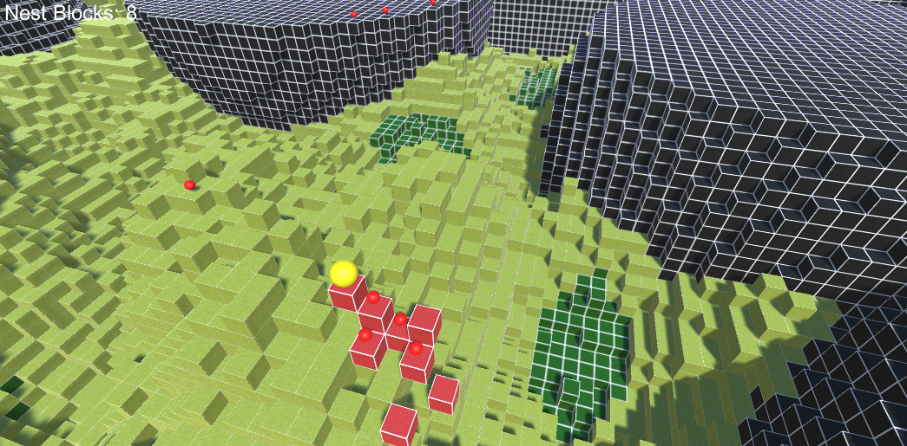

# Assignment 3: Antymology

## Overview
This is a basic ant colony simulation attempting to display the evolution of pheromone-based navigation/activity in order to maximize the production of nest blocks.

## Code
The base code was taken from https://github.com/DaviesCooper/Antymology, slight changes were made to the WorldManager class and the NestBlock class, a NestCounter class was implemented, ant behaviour was implemented in the Ant class, an ant genome class was created to allow for evolution through slight incremental mutation in the AntGenome class, and the evolutionary driver was implemented in the EvolutionManager class.

### Changes
The WorldManager class now spawns a queen ant as well as 20 worker ants using the new AntGeneration method. 

The queen ant is the larger yellow sphere, while the worker ants are the smaller red spheres. I apologize, but I could not for the life of me figure out how to use an actual AntPrefab from the Ant_Icon.png.
It also now has evaporation and diffusion functions to remove and spread the ant pheromones that the ants use to determine their behaviour.
The NestBlock class now has additional fields to allow for the tracking of ant pheromones (FoodPheromone, NestPheromone, DangerPheromone).

### New Code
A nest counter was added to the UI through the implementation of the NestCounter class, this counter is incremented whenever the queen ant builds a new nest block, and is reset when the generation changes. This count is also used as the overall fitness evaluation for generations.

New ant behaviour was implemented in the Ant class.
#### Ant behaviour:
- Ants have 100 health, ants lose 3 health per time tick, when an ants health hits 0, it dies and is destroyed
- If an ant is under a certain threshold, based on their genome, they will attempt to heal by eating the block under them. If the block under them is mulch, and they are the only ant on the block, they succeed and heal to full health while the block is removed. The ant then releases food pheromones to signal to the other ants that there may be more food in the area. The queen ant will not attempt to heal, otherwise she could just heal and build by herself with no need for workers.
- Ants use their current health to determine their next move, if the ants are above their genome specified threshold, they navigate to the location with the highest nest pheromone in an attempt to get back to the queen to give her health. If they are low health they navigate to the location with the highest food pheromone in an attempt to heal. At all health values, ants will attempt to avoid locations with danger pheromones. The queen ant moves very rarely while not building but always moves after building to avoid getting stuck. This movement is random and not pheromone based.
- Ants are able to dig up parts of the world. To dig up some of the world, an ant must be directly ontop of the block. After digging, the block is removed from the map, at the moment worker ants dig randomly at a 2% chance every turn.
- Ants cannot dig up a block of type ContainerBlock
- Ants standing on an AcidicBlock will have the rate at which their health decreases multiplied by 2. Ants on an AcidicBlock will also release danger pheromones to warn other ants
- Ants may give some of their health to other ants occupying the same space (must be a zero-sum exchange). Ants above their genome specified threshold will give 30 of their health to an ant under 40 health. The queen ant will never share her health
- Among the ants there exists a singular queen ant who is responsible for producing nest blocks.
- Producing a single nest block must cost the queen 1/3rd of her maximum health. The queen ant produces nest pheromones to provide a navigational beacon for the worker ants to follow.
- No new ants are created during each evaluation phase.

### Ant Genome:
The ant genome is composed of the following fields:
- foodPheromoneWeight: How strongly to follow food trails
- nestPheromoneWeight: How strongly to follow nest trails  
- dangerPheromoneWeight: How strongly to avoid danger
- healthSwitchThreshold: Health % when behavior switches from nest-seeking to food-seeking
- foodDepositAmount: Strength of food pheromone deposited
- nestDepositAmount: Strength of nest pheromone deposited
This genome can be randomized or mutated from a parent genome.

### Evolutionary Manager:
The evolutionary manager is the evolutionary driver behind the model.
It runs the simulation for 120 seconds, determines if the current genome has performed better than the best genome so far, and then keep track of the current best genome. It will then mutate the current best genome for the next generation. Finally, it resets the world, removing nest blocks, nest block counter, pheromones, and ants before creating new ants with the new genome and running the model again.

## Future Improvements
Ant behaviour can be expanded on with different types of pheromones, for example, a "help me" pheromone released by ants a low health. Ant digging behaviour could also be expanded as well as the nest building behaviour of the queen. Model complexity could be increased with the introduction of predator/prey/competition agents which would also require the alteration of ant behaviour and the introduction of new pheromones within the genome to allow for more complex behaviour. The ants in the current model are already relatively "dumb" and experience movement difficulties, which could definitely be improved.

## How to Run
1. Clone this repository
2. Open the project in Unity 6000.3.x
3. Load `SampleScene` from the Scenes folder
4. Press Play
5. Camera controls:
   - **WASD**: Move camera
   - **Middle-click + Drag**: Rotate view
   - **Q/E**: Move up/down
   - **Shift**: Speed boost